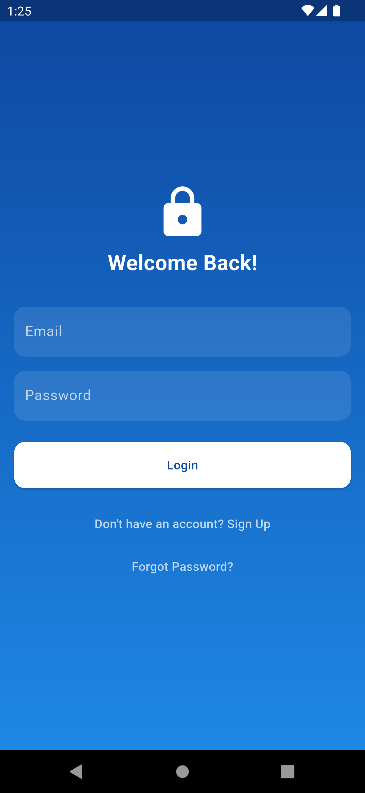
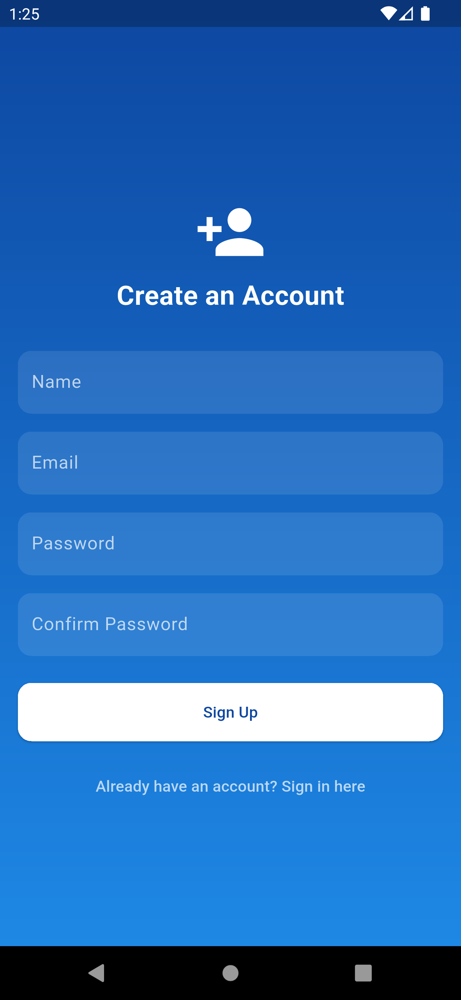
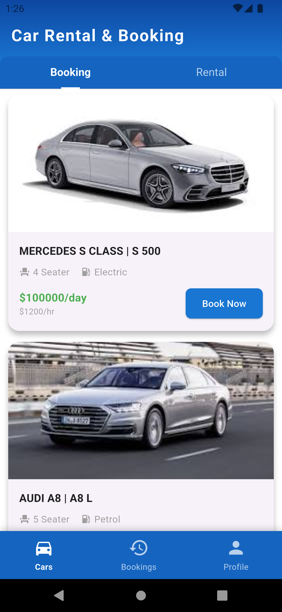
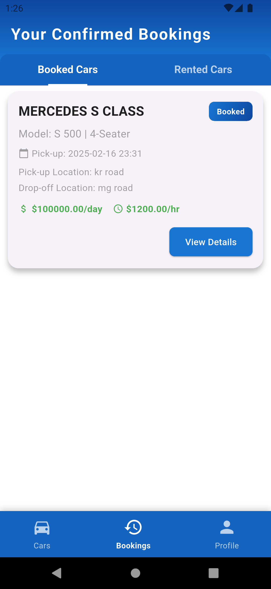
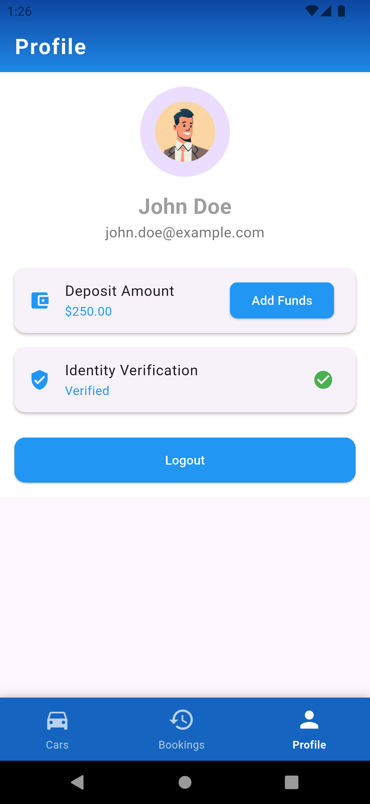

# Car Rental & Sales App

This Flutter application is a prototype for a car rental and sales service developed as part of an internship assignment. The app allows users to book or rent cars, deposit money, verify their identity, view their booking history, and receive notifications regarding rental deadlines. An admin panel is also partially available for managing the app. 

---

## Features

- **User Side:**
  - **Registration & Login:** Secure user authentication.
  - **Car Booking & Rental:** Browse available cars and book or rent them.
  - **Booking History:** View past and current bookings along with car return deadlines.
  - **Notifications:** Receive alerts 30% before the rental period ends to extend the booking.

- **Admin Side (Partially Implemented):**
  - **Basic Admin Panel:** Manage some aspects of the app.
  
---

## Pending Features / Future Enhancements

The following features are part of the original assignment requirements but have not been fully implemented in this version:

- **Penalty and Relisting:**  
  If the user declines to extend the rental or fails to return the car, penalties should be applied and the car should be relisted after 3 days.

- **Admin Location Tracking:**  
  Admins will have the ability to track the phone location of users who have booked a car.

- **Enhanced Admin Controls:**  
  - Admins can add cars for rent with specific charges (per day, per kilometer, or per hour).
  - Admins can view detailed user data, documents, and earnings.

- **Penalty Storage:**  
  Rental penalties and transaction histories will be stored for future reference.

---

## Prerequisites

- [Flutter SDK](https://flutter.dev/docs/get-started/install)
- A working installation of [Android Studio](https://developer.android.com/studio) or [VS Code](https://code.visualstudio.com/) with Flutter & Dart plugins.
- A physical device or emulator for testing.
- Firebase account and project setup (for authentication, notifications, etc.).

---

## Setup

1. **Clone the Repository:**
   ```bash
   git clone https://github.com/Eshwar-M17/carrentalapp.git
   cd carrentalapp
```markdown
## Install Dependencies

```bash
flutter pub get
```

## Firebase Configuration

The Firebase configuration files are included for easy testing. In a production environment, it is recommended to exclude these files using `.gitignore`.

Ensure `android/app/google-services.json` and `ios/Runner/GoogleService-Info.plist` are in place.

## Run the App

- **For Android:**

  ```bash
  flutter run
  ```

- **For iOS:**

  ```bash
  flutter run
  ```

Alternatively, use your preferred IDE’s run/debug options.

## Demo Video & Screenshots

### Demo Video

A short demo video (1–3 minutes) has been recorded to showcase the key features of the app, including:

- User registration and login.
- Browsing available cars and booking/renting a car.
- Viewing booking history and car return deadlines.
- Displaying notifications after 70% of the rental duration to confirm booking.

You can watch the demo video by clicking the thumbnail below:

[](demo_video/demo-vid.mp4)  
### Screenshots

<div align="center">
  
  
  
  
  
</div>


